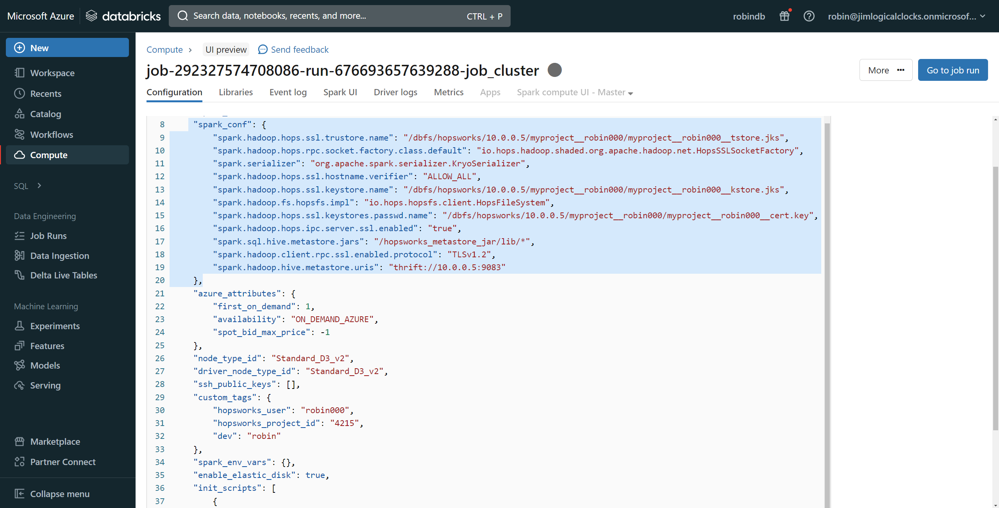

# databricks_bundles

The 'databricks_bundles' project was generated by using the default-python template.

### Prerequisites

This guide assumes that necessary resources such as jars, client certificates and an init script is already uploaded to dbfs and accessible by the workspace running your code.
In order to upload the required files a user can do this step https://docs.hopsworks.ai/3.5/user_guides/integrations/databricks/configuration/#configure-a-cluster.

## Hopsworks integration steps

1. Configure the `job_clusters` in your `resources/*.yml` to include `spark_conf`, `init_scripts` and `custom_tags` such as shown here: https://github.com/robzor92/databricks_bundles/blob/9fe2940f079196bc6ceb768832be4fa3c0c6c9c0/resources/databricks_bundles_job.yml#L28

The values to set can be extracted looking at the json configuration for a cluster already configured by Hopsworks.




2. Configure the `tasks` in your `resources/*.yml` to include `libraries` such as shown here: https://github.com/robzor92/databricks_bundles/blob/60c7c8d4ed2ff1d401f19256ac827ceffd575251/resources/databricks_bundles_job.yml#L20


3. In order to connect to Hopsworks Feature Store, import the hsfs library and supply connection parameters the same way as the first cell here: https://github.com/robzor92/databricks_bundles/blob/main/src/1_feature_pipeline.ipynb

4. Validate the configuration
   ```
   $ databricks bundle validate
   ```


5. To deploy a development copy of this project, type:
    ```
    $ databricks bundle deploy --target dev
    ```
    (Note that "dev" is the default target, so the `--target` parameter
    is optional here.)

    This deploys everything that's defined for this project.
    For example, the default template would deploy a job called
    `[dev yourname] databricks_bundles_job` to your workspace.
    You can find that job by opening your workpace and clicking on **Workflows**.


6. Similarly, to deploy a production copy, type:
   ```
   $ databricks bundle deploy --target prod
   ```

7. To run the job, use the "run" command:
   ```
   $ databricks bundle run
   ```
And then select the databricks_bundles_job
